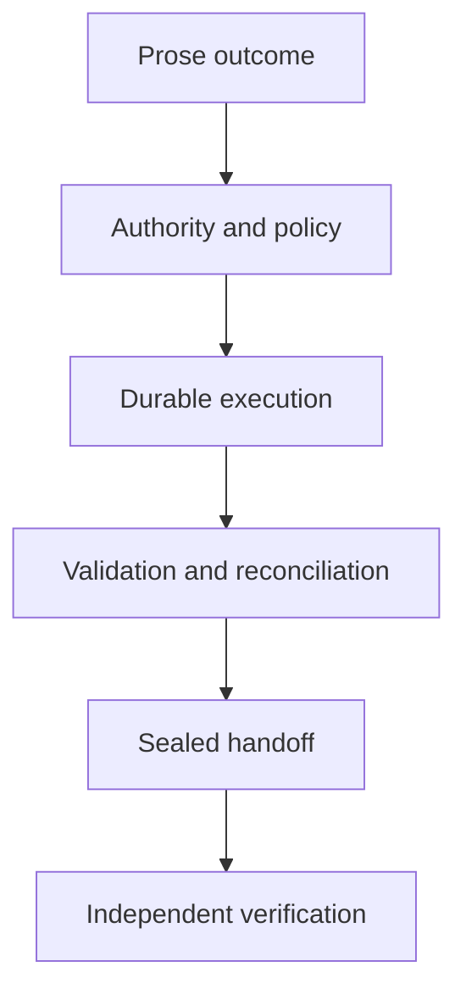

# DoneState

**DoneState completes the work. OpsTruth proves it.**

DoneState is a durable control plane for autonomous coding work in existing repositories. Give it a prose outcome and a standing authority envelope. It runs a coding harness, executes deterministic validation, survives ordinary restarts, and seals the exact result for an independent verifier.

It is deliberately not another coding model. Codex, Pi, OpenClaw or another process can be the harness. DoneState owns the parts that should not depend on model judgement: admission, authority, budgets, leases, idempotency, state transitions, audit evidence and completion semantics.

## Why it exists

Most coding-agent workflows still make a person supervise tool calls or trust an agent's claim that the work is finished. DoneState changes the unit of control:

- A human authorises consequences once for an objective.
- A harness chooses implementation steps inside that boundary.
- Deterministic code records intent before each effect and settlement afterwards.
- Crashes with uncertain effects stop as `AMBIGUOUS_EFFECT`; they are not blindly replayed.
- Only a pinned, signed, independent verifier can move a run to `VERIFIED`.



## Install

Node.js 22.5 or newer is required.

```bash
npm install --global donestate
```

## Fast path

Inside a Git repository with Codex CLI already authenticated:

```bash
donestate go "Fix issue 214 and preserve the public API" \
  --accept "The regression test passes and no public export changes"
```

The Codex adapter uses non-interactive `codex exec`, a workspace-write sandbox and no per-command approval prompts. DoneState still enforces its own objective policy and stops at `AWAITING_VERIFICATION` until an independent signed attestation arrives.

For an explicit, reviewable contract:

```bash
donestate init
# Edit .donestate/objective.json and .donestate/policy.json
donestate run \
  --objective .donestate/objective.json \
  --policy .donestate/policy.json
```

Inspect, resume and hand off a run:

```bash
donestate status RUN_ID
donestate resume RUN_ID
donestate handoff RUN_ID --out verification-handoff.json
donestate attest --file signed-attestation.json
donestate verify-log RUN_ID
```

Run the bounded local demonstration:

```bash
npx donestate demo
```

The demo intentionally ends at `AWAITING_VERIFICATION`. Self-verification would defeat the product boundary.

## ChatGPT plugin preview

Version 0.2 development now includes a ChatGPT and Codex plugin package plus a hosted MCP Worker under `plugins/donestate` and `apps/mcp-worker`. The plugin is the conversational control surface: a user states an outcome, approves one consequence envelope, and monitors durable execution without supervising every command.

The Worker provides GitHub OAuth for public repositories, an encrypted per-user OpenAI credential vault, one Durable Object per run, isolated Cloudflare Sandbox execution, exact-head branch and pull-request publication, durable effect reconciliation, deletion, and signed independent-verifier handoff. Model usage is billed to each user's own OpenAI API account, never a shared DoneState key. The hosted preview is deployed at [donestate-mcp.woeinvests.workers.dev](https://donestate-mcp.woeinvests.workers.dev); its public-repository execution and OpsTruth canary passed. GitHub App maintenance and plugin-directory submission remain separate release gates. See [Current status](docs/CURRENT-STATUS.md) and [Hosted plugin preview](docs/HOSTED-PLUGIN.md).

## Authority model

DoneState requests authority for consequences, not permission for every tool call.

| Authority | Typical consequence | Default |
|---|---|---:|
| `local_read` | Inspect repository state | Granted |
| `local_write` | Edit workspace files | Granted |
| `test` | Run bounded validation | Granted |
| `commit` | Create a local commit | Granted |
| `push` | Mutate a remote branch | Denied |
| `open_pr` | Create a pull request | Denied |
| `merge` | Merge a reviewed change | Denied |
| `deploy` | Mutate a live environment | Denied |
| `publish` | Publish a package or release | Denied |
| `secret_access` | Expose configured secrets to an action | Denied |
| `destructive` | Delete or irreversibly rewrite | Denied |

An envelope can be bound to the SHA-256 digest of one exact objective and can expire. Executables, repository roots, environment keys, argument patterns and action budgets are separately constrained.

## Completion contract

`SUCCEEDED` means a command returned successfully. It does not mean the objective is proven complete.

A run reaches `VERIFIED` only when all of these are true:

1. Every admitted action settled successfully.
2. Reconciliation stayed within policy budgets.
3. DoneState sealed the exact execution snapshot.
4. An Ed25519-signed attestation matches that snapshot.
5. The signer fingerprint was pinned in the run policy.
6. The issuer is independent of DoneState and supplies evidence references.

See [Architecture](docs/ARCHITECTURE.md), [Trust model](docs/TRUST-MODEL.md) and [Threat model](docs/THREAT-MODEL.md).

## Product boundaries

Version 0.1 provides the durable local controller, process-harness adapter, policy enforcement, Git changed-file budget, tamper-evident event chain, recovery semantics, signed verification handoff and CLI. Version 0.2 development adds the hosted public-repository execution slice described above.

The local CLI does not provide a hosted multi-tenant control plane or operating-system sandbox. The production Worker contains the GitHub App maintenance slice, but it is not production-verified until owner setup, selected installation, and a PR-only canary pass. DoneState does not enable merge queues, merge/deployment/release execution, managed verifier keys, a general secret broker, or production fleet controls. Its credential vault is limited to each authenticated user's OpenAI execution key. Remote publication remains denied until its authority class is explicitly granted.

AgentProof remains the transaction and signed-receipt layer for consequential actions. OpsTruth remains the independent read-only verifier. DoneState neither duplicates their roles nor treats its own observations as proof.

## Development

```bash
npm install
npm run check
```

The package has no runtime dependencies. State uses Node's built-in SQLite binding with WAL, full synchronous writes, foreign keys and fenced leases.

## Licence

Apache-2.0.
