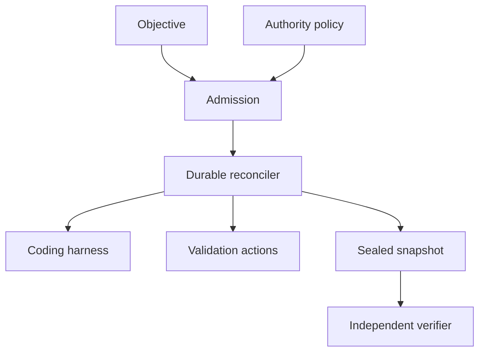
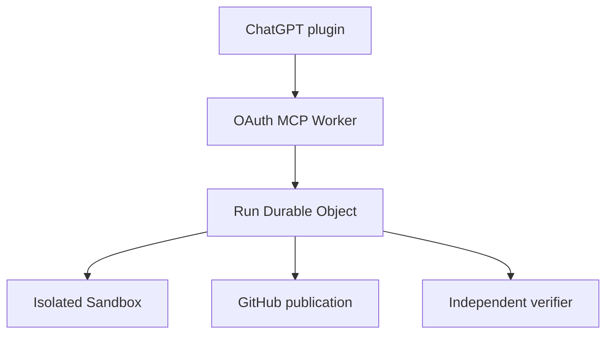

# Architecture

## Control plane

DoneState is a desired-state reconciler for a single repository objective.

The harness may make implementation decisions. It cannot change the objective, widen authority, alter budgets, settle its own action record or declare a terminal verified state.

## State machine

| State | Meaning |
|---|---|
| `RECEIVED` | Objective and policy have been durably stored. |
| `ADMITTED` | Static policy checks passed. |
| `QUEUED` | Hosted execution has been durably scheduled. |
| `EXECUTING` | A harness or local command phase is active. |
| `VALIDATING` | Deterministic validation is active. |
| `PUBLISHING` | A separately authorised publication action is active. |
| `RECONCILING` | Action settlement and budgets are being checked. |
| `AWAITING_VERIFICATION` | An exact snapshot is sealed and awaits an independent signer. |
| `VERIFIED` | A pinned independent verifier signed the matching snapshot. |
| `BLOCKED_AUTHORITY` | A consequence was not granted. |
| `BLOCKED_CAPABILITY` | A required executable or local capability is unavailable. |
| `BLOCKED_SAFETY` | A policy, dependency or budget gate stopped the run. |
| `AMBIGUOUS_EFFECT` | An effect may have occurred but no settlement is durable. |
| `FAILED_SAFE` | An action or independent verification failed without uncertainty. |
| `CANCELLED` | An operator cancelled the objective. |

## Effect sandwich

Each external effect follows this ordering:

1. Acquire a short run lease and current fencing token, then heartbeat it during execution.
2. Persist the action intent and idempotency key in a transaction.
3. Launch the no-shell child process.
4. Redact and bound output.
5. Persist settlement under the same fencing token.

If the process stops between steps 3 and 5, a replacement worker records `AMBIGUOUS_EFFECT`. Generic mutation is not assumed idempotent and is not replayed.

## Persistence

SQLite runs in WAL mode with `synchronous=FULL`, foreign keys and a busy timeout. Events form a SHA-256 hash chain. This makes accidental or post-hoc modification detectable; it is not a substitute for external anchoring or signed receipts.

## Integration boundaries

- **Harness adapters** execute Codex, Pi, OpenClaw or another configured process.
- **AgentProof** may authorise and receipt individual consequential transactions.
- **OpsTruth** independently observes repository and release evidence.
- **DoneState** reconciles the objective and accepts only a pinned signed attestation for terminal verification.

Provider-native GitHub, secret-broker and hosted worker adapters belong outside the core state machine and must obey the same effect and authority contracts.

## Hosted execution plane

The 0.2 development slice places the conversational control surface in the plugin and deterministic ownership in the Worker:

The OAuth token is sealed before it is stored with a run. One Durable Object serialises run ownership and persists action intent before remote mutation. The sandbox receives only the GitHub and model credentials needed for that run. Public output omits the token and bounds and redacts command results.

The plugin is not the execution authority. Its skills translate user intent into explicit tool inputs; the Worker independently validates repositories, refs, consequence grants, budgets and verifier fingerprints.
